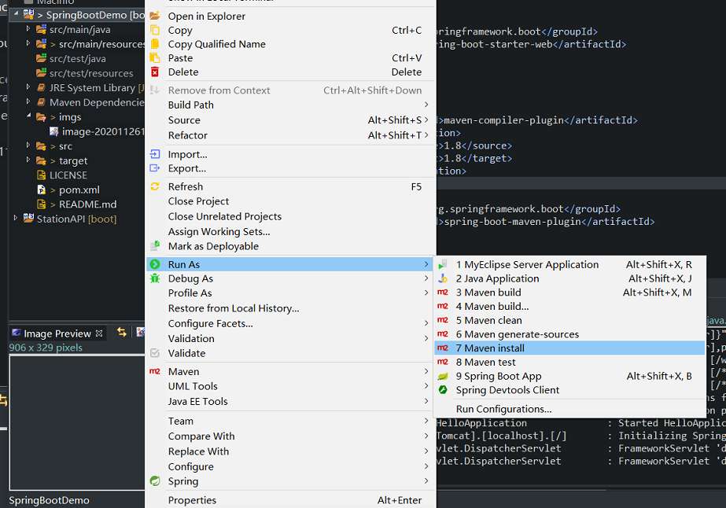

# Springboot-BaseDemo


访问 http://localhost:10100/hello


## 配置

springboot的配置文件有以下

- application.properties
- application-dev.properties 开发环境
- application-prod.properties 运行环境
- application-test.properties 测试环境

在application.properties中配置内容

```
spring.profiles.active=dev
```

说明是项目默认使用配置文件application-dev.properties

发布项目，打包成jar包之后运行

```
java -jar  ***.jar   --spring.profiles.active=prod
```

表示运行使用的是application-prod.properties配置文件

测试环境同理


## 打包jar

在项目上右键`Run AS`->`Maven install`


